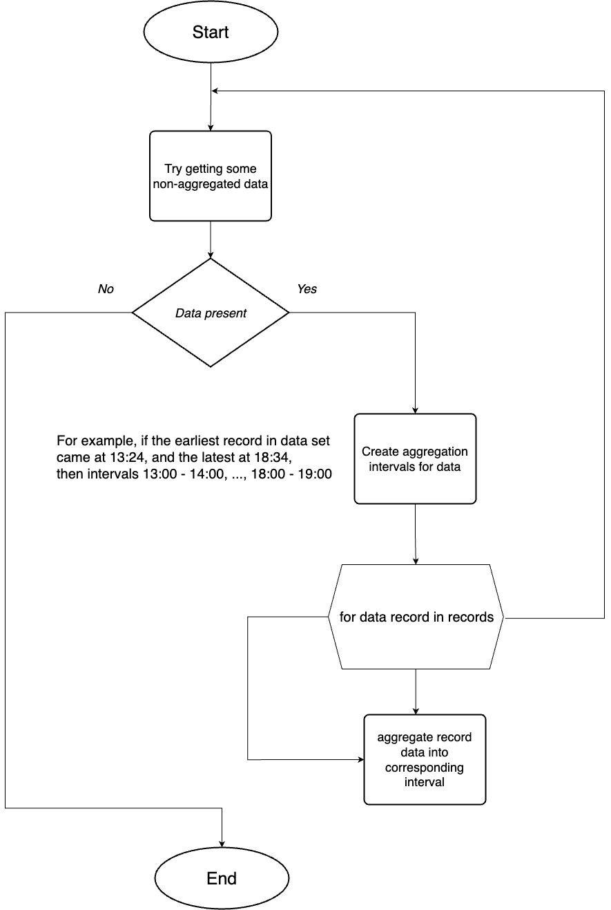

This aggregator app is a part of [energokodros](https://senyehor.github.io/energokodros_website) website. It aggregates real-time incoming energy consumption data into intervals, allowing for much faster querying and less storage space taken. It operates by this state diagram.

